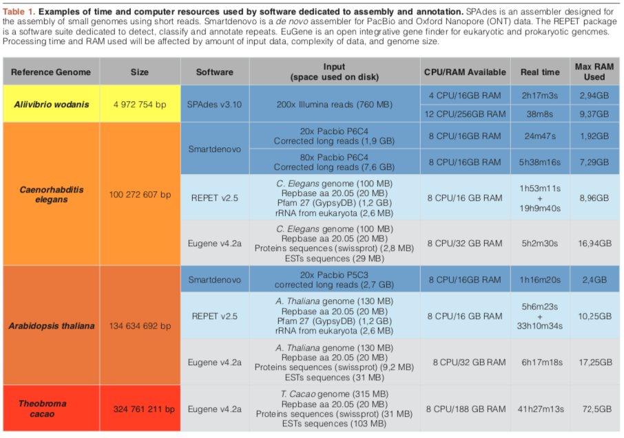
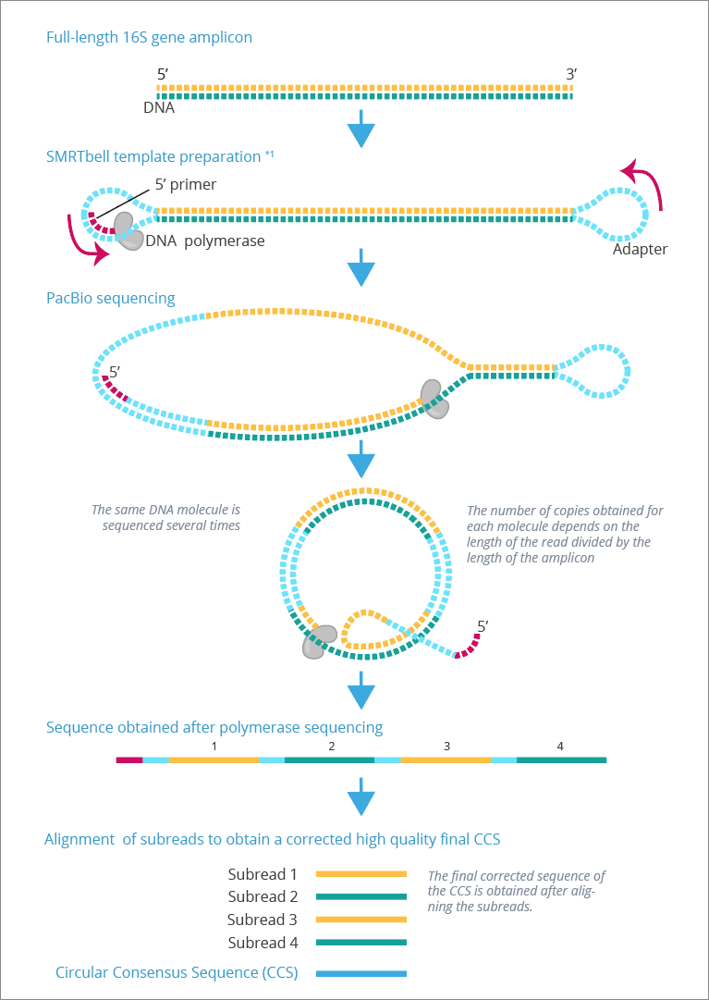
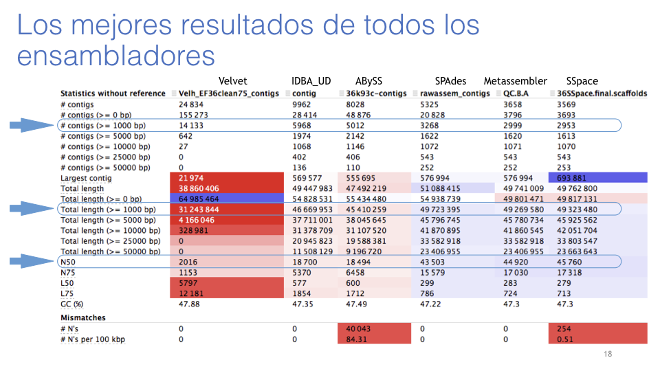
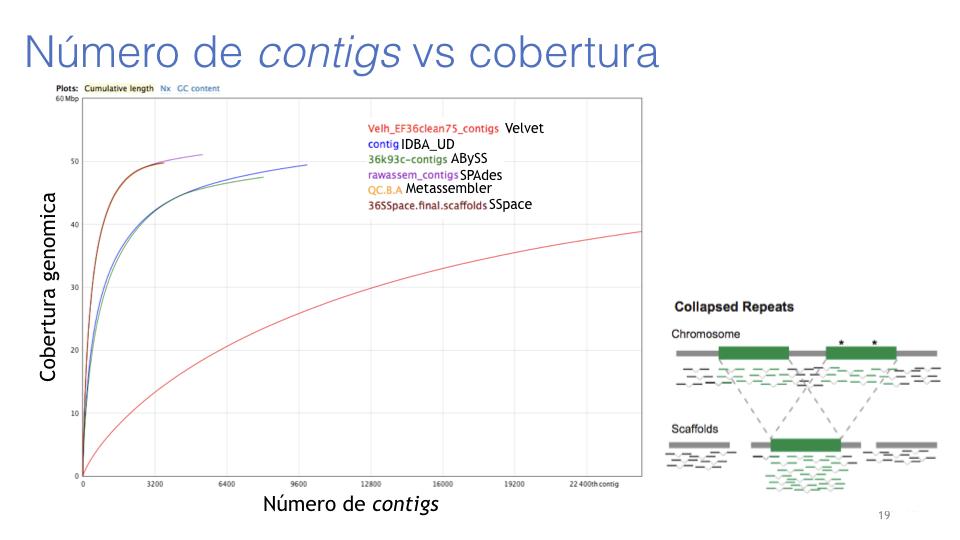

# 3.2 Ensamble y anotación genómica

## Introducción

En un proyecto de ensambe *de novo* y anotación de genoma completo, primero se ensambla la secuencia de nucleótidos de un genoma (lo mas completo posible!) y luego se anota.

La anotación infiere la estructura y función del ensamble genómico. Los genes codificantes siempre se se anotan pero los ncRNA las regiones promotoras y las  secuencias repetitivas también se deben anotar.

Con el avance de las tecnologías de secuenciación masiva el número de genomas disponibles ha aumentado. Pero al abaratar los costos de la secuenciación la calidad de los ensambles genómicos, de manera general, ha disminuido! (principalmente en eucariontes no modelo).

Los costos computacionales de la generación de nuevos ensambles de alta calidad son altos (principalmente en eucariontes no modelo).


¿Realmente necesito secuenciar (ensamblar y anotar) un nuevo genoma completo?

o puedo resolver lo que pretendo con:

​		Ensamble transcriptómico

​		Resecuenciación y mapeo


## 0 Antes de secuenciar

- Para la extracción de DNA, seleccione una cepa que sea un buen representante de la especie y que pueda proporcionar suficiente DNA
- Extraer más DNA del que crees que necesitas y guardar el tejido para repetir extracciones
- Considerar la secuenciación de RNA para reforzar los ensambles genómicos. Idealmente de la misma cepa
- Comparar tecnologías de secuenciación ([Illumina](https://www.illumina.com/), [IonTorrent](https://www.thermofisher.com/mx/es/home/brands/ion-torrent.html), [PacBio](https://www.pacb.com/), [NanoPore](https://nanoporetech.com/applications/dna-nanopore-sequencing), reviews: [1](https://www.sciencedirect.com/science/article/pii/S0888754315300410), [2](https://www.nature.com/articles/nature24286),) y anticipar los programas y recursos computacionales necesarios


## 1 Características genómicas a considerar

- Tamaño del genoma
  - Calcular el tamaño de la secuenciación (cobertura vs profundidad) (aceptable >60x)
  - Usar citometría de flujo o en su defecto conocer los tamaños de los genomas de las especies mas cercanas (BD de C-Value de [hongos](http://www.zbi.ee/fungal-genomesize), [plantas](http://data.kew.org/cvalues) y [animales](http://www.genomesize.com))

- Repeats

  - Son regiones repetidas y/o repetitivas y posiblemente móviles
    - Los *reads* de diferentes *repeats* son tan similares que se ensamblan
    - Propician *mis-assembly* y estimaciones incorrectas del tamaño genómico y número de copias
    - Se ven como ensambles muy fragmentados y mas pequeños
    - Secuencias largas permiten la captura de regiones únicas flanqueando los *repeats*

- Heterocigosidad
  - Por definición un genoma es haploide
  - Los ensambladores colapsan los alelos, pero si la cepa presenta alta heterocigosidad puede tener alelos tan distintos que se ensamblan independientemente
  - Regiones heterócigas se duplican (en diploides) o multiplican (poliploides)
  - o ni se ensamblan!
  - Pop. grandes suelen ser mas heterocigas

- Ploidía
  - Favorecer secuenciar cepas haploides
  - Tejidos diploides o poliploides piden mas secuenciación
  - Los ensambles suelen estar mas fragmentados
- GC%
  - Illumina puede no secuenciar regiones de alto contenido de GC
  - Las de 3ra generación no tienen este problema


## 2 Extracción de DNA de alta calidad

No es lo mismo un buen DNA para PCR que para NGS

#### Cantidad

Debemos entregar una mayor cantidad de DNA que el tamaño de los datos que esperamos recibir (considerando cobertura, profundidad y ploidía) (1 pg =  0.982 Gpb)

#### Pureza

La solución de DNA solo debe contener DNA y H2O. Pero suele estar contaminada con polisacáridos, proteoglicanos, proteínas, metabolitos secundarios, polifenoles, ácidos húmicos, pigmentos... El RNA contaminate impacta en la cuantificación.

Generan problemas durante la construcción de las bibliotecas

Drásticamente problemáticos para Illumina Mate-Pair y 3ra GS.

Usar protocolos de purificación (columnas)

Usar CTAB vs polosacaridos (hongos, plantas, moluscos)

Usar beta-mercaptoethanol y proteinasa k vs proteinas (animales)

Usar PVPP vs polifenoles y aromaticos (plantas)

Quitar todo el etanol, fenol y sales (ej. EDTA) usadas durante la extracción

#### Integridad

Se compromete con el uso de EDTA y buffera a pH inadecuado

Almacenamiento prolongado del DNA a >-20 ºC

No vortex!!!

Pipetear con cariño

Transportar congelado

No congelar y descongelar muchas veces

#### Además

Considerar los genomas de los plástidos

Evitar usar muestras compuestas (si se puede)

Evitar Whole Genome Amplification (si se puede)

Evitar muestras contaminadas por otros organismos (si se puede)


## 3 Elegir la secuenciación

Considerar:

- Costos
- Tamaño de reads
- Cantidad de reads
- Calidad del *base calling*
- Objetivos


Plataformas:

- Secuenciación de primera generación (Sanger)
  - así se secuenció el 1er genoma humano y el de *L. bicolor*

- Secuenciación de segunda generación (454, Illumina, IonTorrent, SOLiD, etc...)
  - 75 - 300 pb x2 

- Secuenciación de tercera generación (PacBio y MINIon)
  - 10-15 (100) Kpb


Protocolos complementarios:

[10x chromium](https://www.youtube.com/watch?v=aUyFzwRFWJQ)

[HiC Proximo](https://www.youtube.com/watch?v=-MxEw3IXUWU)

[Bio-Nano optical mapping](https://www.youtube.com/watch?v=XwBl13Q4ilo)


## 4 requerimentos computacionales

Tamaño y velocidad

Los archivos intermedios son mucho mas grandes que los resultados

Los procesos que no se pueden paralelizar son mas costosos de ram




## 5 Ensamblar

WF para ensamblar:


yo le hice así:


Antes de ensamblar se debe conocer la calidad y limpiar los datos crudos como vimos en la Unidad [3.1](Limpieza_y_calidad.md)

¿Por que los datos de PacBio no se limpian igual que los de Illumina?




#### Ensamble *de novo* vs mapeo a genoma de referencia

*de novo*

Usa solo la información proporcionada en los .fastq y los parámetros del ensamblador

Los ensambladores de secuencias cortas usas como algoritmo los *de Brujin graphs* alimentado por k-meros. Funcionan mejor con profundidades de secuenciación de entre 60 y 80x. 


Los resultados de un ensamble son dependientes del organismo y de los datos. Un algoritmo puede funcionar bien en un caso y mal en otro. 

Los programas para ensamblar con long-read usan Overlap Layout Consensus


Los programas que hacen ensambles híbridos inician con grafos de brujin y después usan las long reads

#### Scaffolding

Se refiere a usar los mismos datos o datos adicionales para unir los contigs generados en el ensamble.

Contig vs scaffolds? -> Ns


### Ejercicio:

1. Entrar al servidor

   ```
   ssh gene8@172.16.9.173 -X -Y
   # dale tu pw
   cd ~/TallerBioinf/Unidad3/H.hv6_toy/bin
   ```


2. Ensamblar el genoma

   Usaremos uno o varios  tamaños de k-mero y  los 2 grupos de datos (raw y clean).

   #### Velvet

   Se ejecuta en 2 pasos velveth (hace los k-meros) y velvetg (hace los grafos).

   Primero creas un directorio para los resultados.
   
   ```
   cd ~/TallerBioinf/Unidad3/H.hv6_toy/bin
mkdir -p ../assem/Velvet
   ```
   
    Velveth
   
```
velveth ../assem/Velvet/Hhv6_31 31 -fastq -shortPaired ../data/Hhv6.R1.fastq ../data/Hhv6.R2.fastq
```

​		Velvetg

```
velvetg ../assem/Velvet/Hhv6_31/
```


#### Calificando un ensamble

1.- <u>Características generales de un ensamble genómico</u>

Podemos generar un resumen mediante la herramienta [Quast](http://quast.sourceforge.net/quast) [(cita)](http://doi.org/10.1093/bioinformatics/btt086).

¿Qué son los valores N50 y L50?

¿Cuales contigs se usan?, ¿Cuales se descartan? y ¿Por qué?

```
cd ~/TallerBioinf/Unidad3/H.hv6_toy

quast.py -t 30 assem/Velvet/Hhv6_31/contigs.fa
```

Revizar las salidas (.txt y .html).
Tal vez necesitemos scp los .html del servidor a nuestra unidad local.

¿scp?





2.- <u>Completitud</u>

[FRCBam](https://github.com/vezzi/FRC_align) reporta mis-assembly.

[Busco](https://busco.ezlab.org/), [gVolante](https://gvolante.riken.jp) y [FGMP](https://github.com/stajichlab/FGMP) reportan completitud.


3.- <u>Pureza</u>
Usamos herramientas de la microbiómica o metagenómica para hacer el bining y/o la asignación taxonómica. Con lo que se detecta contaminación por DNA de otro organismo.

[MaxBin](https://downloads.jbei.org/data/microbial_communities/MaxBin/MaxBin.html) 

Usa una base de datos de genes *housekeeping* propios de organismos comunes para ciertos tipos de muestra.


[VizBin](http://claczny.github.io/VizBin/)

Usa características propias de las secuencias (contigs o reads) de DNA para agruparlas en una gráfica de 2 dimensiones.

Ejemplo: [Endogonaceae genomics](Chang_et_al-2019-New_Phytologist)


#### 6 Anotar transposones

Existen 2 tipos de elementos repetidos:

- De baja complejidad son microsatelites
- De alta complejidad son transposones

Los transposones son clave en todos los genómas eucarióticos y pueden representar hasta el 90% del genoma en algunos taxa.

Su número se puede correlacionar con el tamaño genómico y su organización.

Se usa:

[RepeatMasker](http://www.repeatmasker.org/)

Que detecta regiones repetidas con BLASTall y las puede resumir o cuantificar.

[REPET package](https://urgi.versailles.inra.fr/Tools/REPET) 

Que usa BLASTall vs it self, y blast vs DB de TEs.


## Anotación

Anotar un genoma es agregar información biológica comprensible a su secuencia de DNA.

Principalmente enfocada en detectar y asignar funciones a las potenciales regiones codificantes.

Aunque también, cuando es necesario se puede usar:

[tRNAscan-se](http://lowelab.ucsc.edu/tRNAscan-SE/) para transferentes

[INFERNAL](http://eddylab.org/infernal/) para todos los ncRNA

 

#### 7 Predicción de modelos génicos

También llamada anotación estructural, es la detección de sitios de inicio de la replicación en marco de lectura con codones de paro.

Predicción <u>intrínseca</u> vs <u>extrínseca</u>.


Usamos [AUGUSTUS](http://bioinf.uni-greifswald.de/augustus/) para predecir de manera intrínseca.

#### 8 Asignación funcional

Comparación de los genes predichos vs DB de alta calidad


#### Ejercicio:

Predecir y asignar los genes y funciones del genoma que ensamblamos. 

#### Predicción

Usamos [Augustus](http://bioinf.uni-greifswald.de/augustus/) para <u>predecir</u> de manera intrínseca.

Usa 2 pasos:

Uno de entrenamiento (con cDNA de la misma sp. o cercana) y uno de predicción.

```
export PATH=$PATH:~/augustus/bin:~/augustus/scripts

export AUGUSTUS_CONFIG_PATH=/usr/local/bin/augustus
```

```
augustus --species=saccharomyces_cerevisiae_S288C ../data/S.cerevisiae.fna
```

También está [Augustus on line](http://bioinf.uni-greifswald.de/webaugustus/index.gsp)


#### Asignación funcional

Usaremos [InterProScan](https://www.ebi.ac.uk/interpro/beta/) para la <u>AF</u>.

Es un programa para la predicción funcional de secuencias de AA que se asocia a muchas DB especializadas.

[UniProt](https://www.uniprot.org/)

[Gene Ontology](http://geneontology.org/docs/go-annotations/)

[CAZy](http://www.cazy.org/)

[KEGG](https://www.genome.jp/kegg/)

```
mkdir -p /TallerBioinf/Unidad3/H.hv6_toy/annot/interproscan
```

```
interproscan -i ../annot/Hhv6_aug.aa -o Hhv6 -iprlookup -goterms -f tsv
```

Revisar las [salidas](https://github.com/ebi-pf-team/interproscan/wiki/InterProScan5OutputFormats) de interpro ([ejemplo en html](https://www.ebi.ac.uk/interpro/sequencesearch/iprscan5-S20190911-185515-0091-39181847-p1m))


Análisis de metabolismos

[Gosth KOALA](https://www.kegg.jp/ghostkoala/)

BLAST KOALA

Permite obtener términos [KO](https://www.kegg.jp/kegg/ko.html) y mapear online sobre la enciclopedia KEGG.

[Liga](https://www.kegg.jp/kegg-bin/blastkoala_result?id=76d500542eeae4cccb16fe031a61ac5feb485803&passwd=VyhJNv&type=ghostkoala) al análisis del proteoma de una levadura que hice para la clase.


#### 9 Poner los datos accesibles y en formatos estandard

#### 10 Poner tu código accesible

Revisar [Unidad 1](Unidad1)

Finalmente el autor concluye que un proyecto genómico debe ser **FAIR**

Findable, Accessible, Interoperable, and Reusable (FAIR)

([Dominguez Del Angel et al. 2018](2018  Dominguez Del Angel et al. 10 steps in genomics.pdf))

**DATOS**

**Findable**: Usar identificadores únicos y persistentes a nivel mundial para los datos y metadatos. Hacer posible rastrear análisis anteriores y relacionarlos con la anotación actual. La anotación en desuso debe seguir siendo rastreable. 
**Accesible**: Registro adecuado de datos y metadatos en un repositorio público o autosuficiente adecuado. Todos los datos deben ser indexados y buscables y accesibles mediante un identificador utilizando protocolos estandarizados. El código se eberá depositar en ELIXIR, GitHub o Docker.
**Interoperable**: Los datos y metadatos deben depositarse utilizando el o los formatos más utilizados. El código y los programas deben especificar sus versiones y las versiones delas bases de datos. Deben poder usarse modularmente e interactuar con otros programas.
**Reusable**: Los datos estén suficientemente bien caracterizados para ser reutilizados de manera efectiva en futuros análisis o para ser desafiados por nuevos métodos de evaluación. Las licencias deben ser lo menos restrictivas posible. El código debe ser abierto, estar encapsulado en repositorios o contenedores y estar documentado.


#### 11 Re-analizar

#### 


