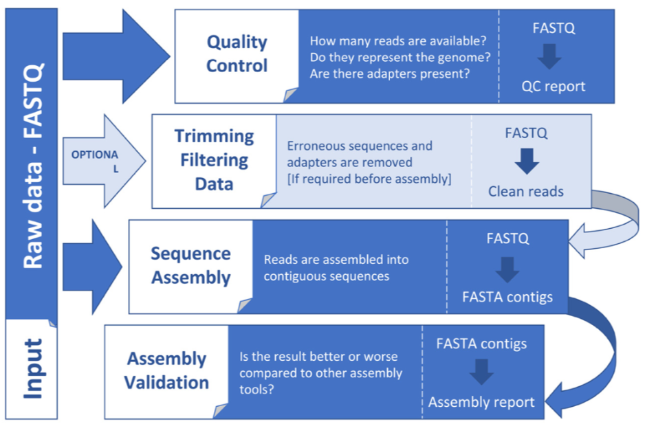
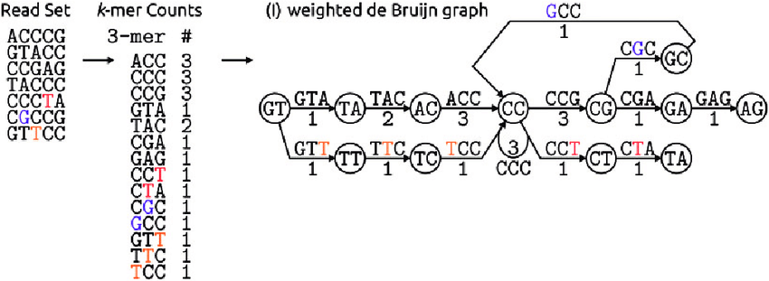

# 3.2 Ensamble y anotación genómica

## Introducción

En un proyecto de ensambe *de novo* y anotación de genoma completo, primero se ensambla la secuencia de nucleótidos de un genoma (lo mas completo posible!) y luego se anota.

La anotación infiere la estructura y función del ensamble genómico. Los genes codificantes siempre se se anotan pero los ncRNA las regiones promotoras y las  secuencias repetitivas también se deben anotar.

Con el avance de las tecnologías de secuenciación masiva el número de genomas disponibles ha aumentado. Pero al abaratar los costos de la secuenciación la calidad de los ensambles genómicos, de manera general, ha disminuido! (principalmente en eucariontes no modelo).

Los costos computacionales de la generación de nuevos ensambles de alta calidad son altos (principalmente en eucariontes no modelo).


¿Realmente necesito secuenciar (ensamblar y anotar) un nuevo genoma completo?

o puedo resolver lo que pretendo con:

​		Ensamble transcriptómico

​		Resecuenciación y mapeo


## 0 Antes de secuenciar

- Para la extracción de DNA, seleccione una cepa que sea un buen representante de la especie y que pueda proporcionar suficiente DNA
- Extraer más DNA del que crees que necesitas y guardar el tejido para repetir extracciones
- Considerar la secuenciación de RNA para reforzar los ensambles genómicos. Idealmente de la misma cepa
- Comparar tecnologías de secuenciación ([Illumina]([https://www.illumina.com](https://www.illumina.com/)), [IonTorrent](https://www.thermofisher.com/mx/es/home/brands/ion-torrent.html), [PacBio]([https://www.pacb.com](https://www.pacb.com/)), [NanoPore](https://nanoporetech.com/applications/dna-nanopore-sequencing), reviews: [1](https://www.sciencedirect.com/science/article/pii/S0888754315300410), [2](https://www.nature.com/articles/nature24286),) y anticipar los programas y recursos computacionales necesarios


## 1 Características genómicas a considerar

- Tamaño del genoma
  - Calcular el tamaño de la secuenciación (cobertura vs profundidad) (aceptable >60x)
  - Usar citometría de flujo o en su defecto conocer los tamaños de los genomas de las especies mas cercanas (BD de C-Value de [hongos](http://www.zbi.ee/fungal-genomesize), [plantas](http://data.kew.org/cvalues) y [animales](http://www.genomesize.com))

- Repeats

  - Son regiones repetidas y/o repetitivas y posiblemente móviles
    - Los *reads* de diferentes *repeats* son tan similares que se ensamblan
    - Propician *mis-assembly* y estimaciones incorrectas del tamaño genómico y número de copias
    - Se ven como ensambles muy fragmentados y mas pequeños
    - Secuencias largas permiten la captura de regiones únicas flanqueando los *repeats*

- Heterocigosidad
  - Por definición un genoma es aploide
  - Los ensambladores colapsan los alelos, pero si la cepa presenta alta heterocigosidad puede tener alelos tan distintos que se ensamblan independientemente
  - Regiones heterócigas se duplican (en diploides) o multiplican (poliploides)
  - o ni se ensamblan!
  - Pop. grandes suelen ser mas heterocigas

- Ploidía
  - Favorecer secuenciar cepas aploides
  - Tejidos diploides o poloploides piden mas secuenciación
  - Los ensambles suelen estar mas fragmentados
- GC%
  - Illumina puede no secuenciar regiones de alto contenido de GC
  - Las de 3ra generación no tienen este problema


## 2 Extracción de DNA de alta calidad

No es lo mismo un buen DNA para PCR que para NGS

#### Cantidad

Debemos entregar una mayor cantidad de DNA que el tamaño de los datos que esperamos recibir (considerando cobertura, profundidad y ploidía) (1 pg =  0.982 Gpb)

#### Pureza

La solución de DNA solo debe contener DNA y H2O. Pero suele estar contaminada con polisacáridos, proteoglicanos, proteínas, metabolitos secundarios, polifenoles, ácidos húmicos, pigmentos... El RNA contaminate impacta en la cuantificación.

Generan problemas durante la construcción de las bibliotecas

Drásticamente problemáticos para Illumina Mate-Pair y 3ra GS.

Usar protocolos de purificación (columnas)

Usar CTAB vs polosacaridos (hongos, plantas, moluscos)

Usar beta-mercaptoethanol y proteinasa k vs proteinas (animales)

Usar PVPP vs polifenoles y aromaticos (plantas)

Quitar todo el etanol, fenol y sales (ej. EDTA) usadas durante la extracción

#### Integridad

Se compromete con el uso de EDTA y buffera a pH inadecuado

Almacenamiento prolongado del DNA a >-20 ºC

No vortex!!!

Pipetear con cariño

Transportar congelado

No congelar y descongelar muchas veces

#### Además

Considerar los genomas de los plástidos

Evitar usar muestras compuestas (si se puede)

Evitar Whole Genome Amplification (si se puede)

Evitar muestras contaminadas por otros organismos (si se puede)


## 3 Elegir la secuenciación

Considerar:

- Costos
- Tamaño de reads
- Cantidad de reads
- Calidad del *base calling*
- Objetivos


Plataformas:

- Secuenciación de primera generación (Sanger)
  - así se secuenció el 1er genoma humano y el de *L. bicolor*

- Secuenciación de segunda generación (454, Illumina, IonTorrent, SOLiD, etc...)
  - 75 - 300 pb x2 

- Secuenciación de tercera generación (PacBio y MINIon)
  - 10-15 (100) Kpb


Protocolos complementarios:

[10x chromium](https://www.youtube.com/watch?v=aUyFzwRFWJQ)

[HiC Proximo](https://www.youtube.com/watch?v=-MxEw3IXUWU)

[Bio-Nano optical mapping](https://www.youtube.com/watch?v=XwBl13Q4ilo)


## 4 requerimentos computacionales

Tamaño y velocidad

Los archivos intermedios son mucho mas grandes que los resultados

Los procesos que no se pueden paralelizar son mas costosos de ram


## 5 Ensamblar

WF para ensamblar:





yo le hice así:


Antes de ensamblar se debe conocer la calidad y limpiar los datos crudos como vimos en la Unidad [3.1](Limpieza_y_calidad.md)

¿Por que los datos de PacBio no se limpian igual que los de Illumina?


#### Ensamble *de novo* vs mapeo a genoma de referencia

*de novo*

Usa solo la información proporcionada en los .fastq y los parámetros del ensamblador

Los ensambladores de secuencias cortas usas como algoritmo los *de Brujin graphs* alimentado por k-meros. Funcionan mejor con profundidades de secuenciación de entre 60 y 80x. 




Los resultados de un ensamble son dependientes del organismo y de los datos. Un algoritmo puede funcionar bien en un caso y mal en otro. 

Los programas para ensamblar con long-read usan Overlap Layout Consensus


Los programas que hacen ensambles híbridos inician con grafos de brujin y después usan las long reads

#### Scaffolding

Se refiere a usar los mismos datos o datos adicionales para unir los contigs generados en el ensamble.

Contig vs scaffolds? -> Ns


### Ejercicio:

1. Entrar al servidor

   ```
   ssh gene8@172.16.9.173 -X -Y
   # dale tu pw
   cd ~/TallerBioinf/Unidad3/H.hv6_toy/bin
   ```


2. Ensamblar el genoma

   Usaremos uno o varios  ensamblador con los mismos parámetros (-k) pero con los 2 grupos de datos (raw y clean)

   

   ### SPADES

   ```
   mkdir ../assem/raw
   spades.py -1 ../data/Hhv6.R1.fastq -2 Hhv6.R2.fastq --careful -k 31,41,51,61,71,81,91 -t 4 -o raw
   ```

   ```
   mkdir ../assem/clean
   spades.py -1 ../data/Hhv6.R1.fastq -2 Hhv6.R2.fastq --careful -k 31,41,51,61,71,81,91 -t 4 -o clean
   ```

   ### IDBA_UD

   http://i.cs.hku.hk/~alse/hkubrg/projects/idba_ud/

   Peng, Y., et al. (2010) IDBA- A Practical Iterative de Bruijn Graph De Novo Assembler. RECOMB. Lisbon.

   ```
   #mkdir ..../IDBA_UD
   ```

   le daré el tercer juego de datos para el --read_level_2

   primero se integran las lecturas pareadas en un solo archivo:

   ```
   interleave-reads.py ../data/Hhv6.R1.fastq ../data/Hhv6.R1.fastq -o Hhv6_InterRaw.fastq
   ```

   se eliminan las calidades

   ```
   fastq_to_fasta -n -v -i Hhv6_InterRaw.fastq -o Hhv6_InterRaw.fasta
   ```

   se ensambla

   ```
   idba_ud -r Hhv6_InterRaw.fasta --mink 31 --maxk 91 --step 10 --pre_correction -o idba_31-91_s10 --num_threads 4
   ```

   #### Velvet

   Se ejecuta en 2 pasos velveth y velvetg

   ```
   #mkdir Velvet; cd Velvet
   ```

   ```
   velveth Velh_Hhv6_raw71 31 -fastq -shortPaired ../data/Hhv6.R1.fastq .../data/Hhv6.R2.fastq
   
   velvetg Velh_Hhv6_raw71/
   ```

   

3. Evaluar el ensamble

   ```
   ./quast-4.6.3/quast -t 30 ../assem/clean/contigs.fa ../assem/raw/contigs.fa
   ```

   Tal vez necesitemos scp los .html del servidor a nuestra unidad local

   ¿scp?

#### Calificando un ensamble

[Quast]() [Paper](http://doi.org/10.1093/bioinformatics/btt086)


Ademas:

FRCBam reporta mis-assembly

Busco y SIGMA reportan completitud

MaxBin y VizBin detecta contaminacion por DNA de otro organismo


#### 6 Anotar transposones

#### 7 Predecir modelos génicos

#### 8 Anotar usando bases de datos de alta calidad

#### 9 Poner los datos accesibles y en formatos estandard

#### 10 poner tu codigo accesible

#### 11 Re-analizar

#### 


Findable, Accessible, Interoperable, and Reusable (FAIR)

([Dominguez Del Angel et al. 2018](https://f1000researchdata.s3.amazonaws.com/manuscripts/14771/99439b36-6d2f-44ae-a2f6-bbb0917e5073_13598_-_victoria_del_angel.pdf?doi=10.12688/f1000research.13598.1&numberOfBrowsableCollections=17&numberOfBrowsableInstitutionalCollections=4&numberOfBrowsableGateways=22))
